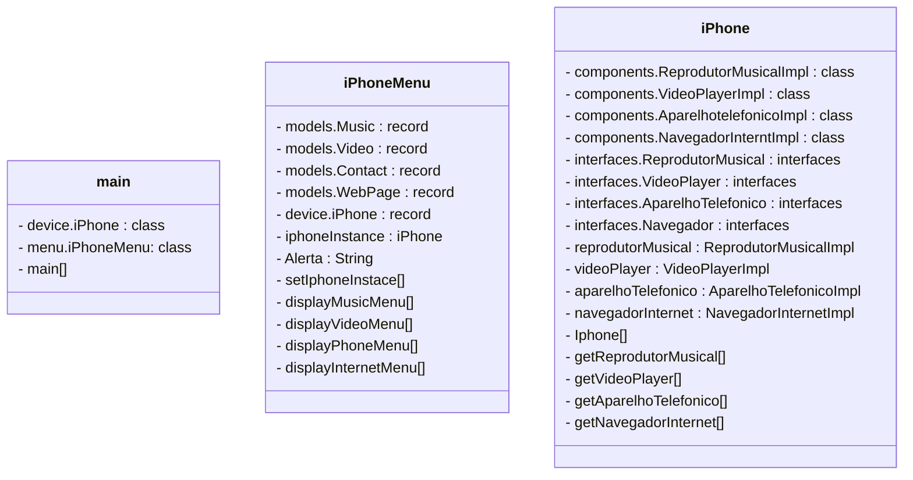

# Projeto iPhone Digital
Este projeto simula as funcionalidades básicas de um iPhone, integrando reprodutor musical, aparelho telefônico e navegador de internet. Desenvolvido em Java, o sistema oferece uma experiência interativa via console, permitindo ao usuário explorar as diversas capacidades de um smartphone moderno.

## Visão Geral do Projeto
O iPhone Digital é uma aplicação em Java que emula um iPhone, centralizando três módulos principais:

* Reprodutor Musical: Permite ao usuário selecionar e reproduzir músicas, pausar, avançar e retroceder faixas.
* Aparelho Telefônico: Simula chamadas, recebimento de chamadas, encerramento de ligações e envio de mensagens de voz.
* Navegador na Internet: Oferece funcionalidades como navegação por URLs, atualização de página, navegação no histórico e gerenciamento de abas.
O objetivo principal foi integrar esses componentes em um único sistema coeso, demonstrando o uso de interfaces, classes e tratamento de exceções em Java.

## Características do Projeto
* Modularidade: Divisão das funcionalidades em componentes (ReprodutorMusicalImpl, AparelhoTelefonicoImpl, NavegadorInternetImpl) que implementam interfaces específicas, promovendo um design limpo e extensível.
* Gerenciamento de Músicas: Capacidade de reproduzir, pausar, selecionar próxima/anterior música.
* Gerenciamento de Chamadas: Simulação de chamadas em andamento, recebimento e encerramento de ligações.
* Navegação Web: Navegação entre páginas, recarregar, voltar no histórico e manipulação de abas.
* Tratamento de Exceções: Implementação de classes de exceção personalizadas (NavegadorException, TelefoneException, MusicaException) para um controle de erros robusto.
* Interatividade: Interface de console que guia o usuário através dos menus de cada funcionalidade do iPhone.
Tecnologias Utilizadas
* Linguagem: Java
IDE: Visual Studio Code (ou qualquer IDE Java compatível como Eclipse, IntelliJ IDEA)
* Estruturas de Dados: ArrayList para listas de itens, Stack para histórico de navegação.
## Diagrama UML
O diagrama de classes a seguir ilustra a estrutura e os relacionamentos entre os principais componentes do projeto iPhone Digital.

